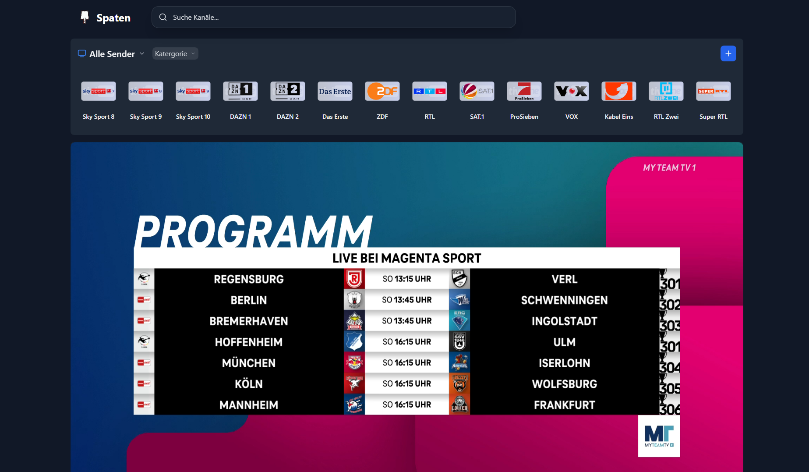
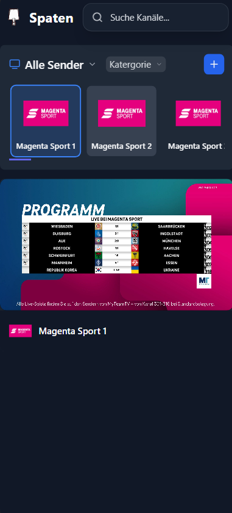

# 📺 HomeWatcher (IPTV Restream)

> ⚠️ **Note:**
> This project is still under **active development**.
> Expect missing features, bugs, or changes at any time.
> Use with caution and feel free to share feedback or ideas!

---

## 📖 About

**HomeWatcher** is a lightweight, self-hosted IPTV restreaming stack with an integrated CyberGhost VPN tunnel, a modern browser-based UI, and automatic container updates via Watchtower.

### Key Features

- 🔒 **VPN Tunneling** – All backend and Nginx traffic is routed through CyberGhost (OpenVPN), keeping streams private and bypassing geo-restrictions.
- 🎬 **Stream Restreaming** – Re-routes streams without re-encoding (FFmpeg proxy/restream modes) for maximum compatibility.
- 🖥️ **Modern Web UI** – Browser-based interface with direct, proxy, and restream playback modes.
- 👥 **Watch2Gether Synchronization** – Synchronized IPTV playback with friends in real time.
- 🔄 **Watchtower Auto-Updates** – Container images are automatically updated daily at 04:00 AM.

---

## 🗂️ Directory Structure

```
HomeWatcher/
├── backend/                  # Node.js backend (stream proxy / restream logic)
│   └── Dockerfile
├── deployment/
│   └── nginx/
│       └── nginx.conf        # Nginx reverse proxy configuration
├── frontend/                 # Vite/React frontend (static UI)
│   └── Dockerfile
├── images/                   # Repository screenshots
├── vpn/                      # VPN certificates & config (NOT committed)
│   ├── README.md             # Setup instructions for VPN files
│   ├── ca.crt                # ← place here manually
│   ├── client.crt            # ← place here manually
│   ├── client.key            # ← place here manually
│   ├── openvpn.ovpn          # ← place here manually
│   └── credentials.txt       # ← place here manually (user/pass)
├── .env.example              # Environment variable template
├── .gitignore
├── docker-compose.yml
└── README.md
```

---

## 🚀 Quickstart

### Prerequisites

- [Docker](https://docs.docker.com/get-docker/) and Docker Compose installed
- A valid **CyberGhost VPN** account with OpenVPN configuration files

### 1. Clone the Repository

```bash
git clone https://github.com/TillitschScHocK/HomeWatcher
cd HomeWatcher
```

### 2. Place VPN Certificates

Copy your CyberGhost OpenVPN files into the `vpn/` directory:

```
vpn/ca.crt
vpn/client.crt
vpn/client.key
vpn/openvpn.ovpn
vpn/credentials.txt   ← Line 1: username, Line 2: password
```

See [`vpn/README.md`](vpn/README.md) for detailed instructions on how to obtain these files.

### 3. Configure Environment

```bash
cp .env.example .env
```

Edit `.env` to match your setup (LAN subnet, UI port, stream delays, etc.).

### 4. Start the Stack

```bash
docker compose up -d --build
```

The UI is available at:

- [http://localhost:1966](http://localhost:1966) (or your configured `UI_PORT`)
- [http://YOUR-SERVER-IP:1966](http://YOUR-SERVER-IP:1966)

> [!IMPORTANT]
> If a channel or playlist does not work, try switching to `proxy` or `restream` mode in the UI.
> These modes solve most playback issues. See [Channel Mode](#channel-mode) for details.

---

## 🌐 Network Architecture

```
[ LAN Client (Browser) ]
         │
         │  HTTP :1966
         ▼
┌─────────────────────────────────────┐
│         VPN Container               │
│   (dperson/openvpn-client)          │
│   Publishes port ${UI_PORT}:80      │
│   All egress → CyberGhost VPN       │
│                                     │
│  ┌──────────────────────────────┐   │
│  │      Nginx (network:vpn)     │   │
│  │   Reverse Proxy / Router     │   │
│  └────────┬─────────┬───────────┘   │
│           │         │               │
│    ┌──────┘   ┌─────┘               │
│    ▼          ▼                     │
│  Frontend   Backend (network:vpn)   │
│  (bridge)   Streams proxied/        │
│             restreamed via VPN      │
└─────────────────────────────────────┘
         │
         ▼
  [ CyberGhost VPN Server ]
         │
         ▼
  [ IPTV Source / Internet ]
```

**LAN traffic** (configured via `LAN_SUBNET`) bypasses the VPN tunnel (split-tunneling), so local services remain reachable.

---

## ⚙️ Configuration

### Environment Variables (`.env`)

| Variable | Default | Description |
|---|---|---|
| `LAN_SUBNET` | `192.168.0.0/16` | Local LAN subnet excluded from VPN tunnel |
| `UI_PORT` | `1966` | Host port for the web UI |
| `VITE_STREAM_DELAY` | `18` | Stream buffer delay in seconds |
| `VITE_STREAM_PROXY_DELAY` | `30` | Additional proxy buffer delay in seconds |
| `WATCHTOWER_CLEANUP` | `true` | Remove outdated images after Watchtower update |

### Channel Mode

You can choose between **three playback modes**:

#### 🔹 `Direct`

- Uses the source stream URL directly in the browser.
- Not reliable due to CORS, IP restrictions, and missing header support.
- Only recommended for testing.

#### 🔹 `Proxy` (Preferred)

- Streams are proxied through the backend (and thus through the VPN).
- Bypasses CORS issues and supports custom headers.
- Best choice for most users.

#### 🔹 `Restream`

- The backend caches and restreams the source via FFmpeg — no re-encoding.
- Useful for providers that restrict by IP or cause sync issues.
- May cause slightly longer initial load times.

---

## 📱 Preview

### 💻 Browser Application


### 📲 Mobile Application


---

## 🔐 Security Note

> ⚠️ **The web UI has no built-in authentication.**

Anyone who can reach the UI port can control the stream and access the playlist.

**Recommendations:**

- Expose the UI on your **internal LAN only** and do not forward the port to the internet.
- If external access is required, place the stack behind a reverse proxy with authentication (e.g. Authelia, Basic Auth via Nginx, or Cloudflare Access).
- Alternatively, restrict access via firewall rules to trusted IP ranges.

---

## ❓ FAQ & Common Issues

### Which streaming mode should I use?

Start with **Direct** → if it fails, switch to **Proxy** → if it still fails, try **Restream**.

### Can I use channels in another IPTV player?

Yes! Click the 📺 **TV button** in the frontend to generate a playlist link. You can then use this link in any IPTV player.

### The VPN container keeps restarting — what is wrong?

Most likely one of the certificate files is missing or the path inside `openvpn.ovpn` references external files. Make sure all five files are present in the `vpn/` directory and that the `.ovpn` config uses relative paths or points to `/vpn/ca.crt` etc.

---

## 🙏 Acknowledgements

A huge thank you to the original project:
[📦 IPTV-Restream by antebrl](https://github.com/antebrl/IPTV-Restream)
